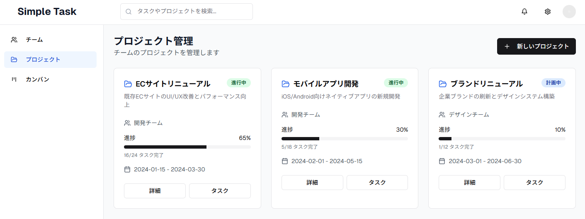
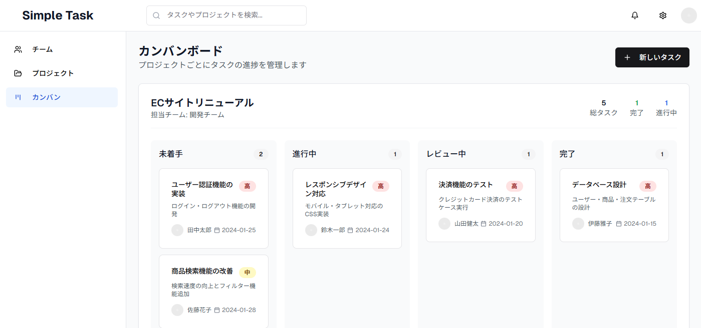
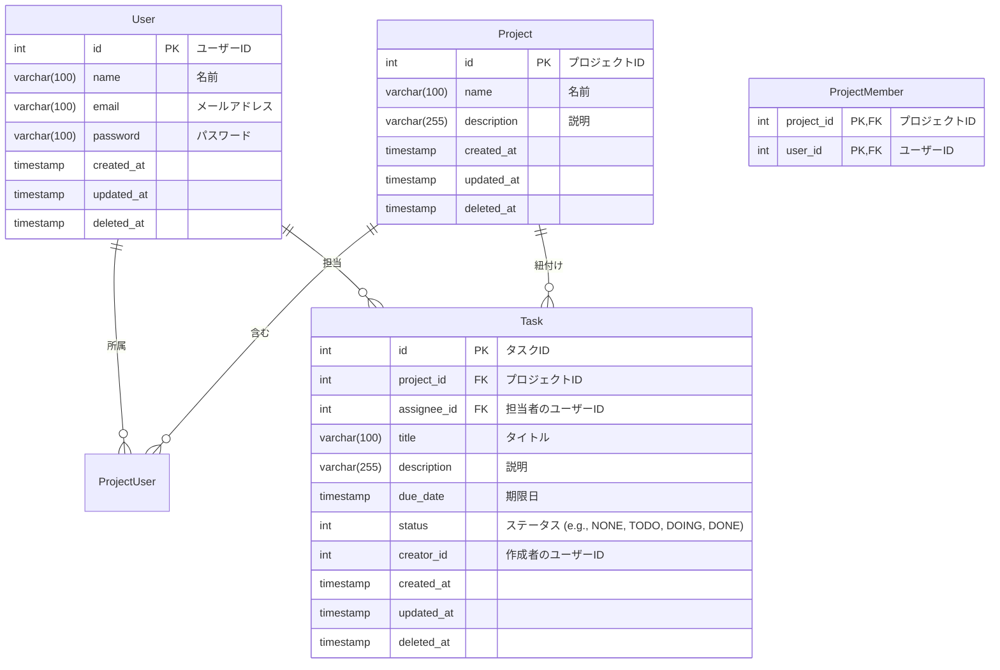

# simple-task-app

## 1. 概要

シンプルなタスク管理アプリケーション

- 主な機能
  - ユーザー管理（サインアップ、サインイン）
  - プロジェクト管理
  - タスク管理

## 2.画面設計

画面のイメージを v0 で作成

### プロジェクト管理

### タスク管理

## 3. 機能一覧

### ユーザー関連

| 機能               | HTTP メソッド | パス                   | 備考                                 |
| :----------------- | :------------ | :--------------------- | :----------------------------------- |
| **サインアップ**   | `POST`        | `/signup`              | 新規ユーザー登録                     |
| **サインイン**     | `POST`        | `/signin`              | ユーザー認証とセッショントークン発行 |
| **サインアウト**   | `POST`        | `/signout`             | セッション破棄                       |
| **パスワード変更** | `PUT`         | `/users/{id}/password` | 特定ユーザーのパスワード変更         |

---

### プロジェクト関連

| 機能                     | HTTP メソッド | パス             | 備考                       |
| :----------------------- | :------------ | :--------------- | :------------------------- |
| **プロジェクト作成**     | `POST`        | `/projects`      | 新しいプロジェクトの作成   |
| **プロジェクト情報変更** | `PUT`         | `/projects/{id}` | 特定プロジェクト情報の更新 |
| **プロジェクト削除**     | `DELETE`      | `/projects/{id}` | 特定プロジェクトの削除     |
| **プロジェクト一覧取得** | `GET`         | `/projects`      | 全プロジェクトの取得       |
| **プロジェクト詳細取得** | `GET`         | `/projects/{id}` | 特定プロジェクトの詳細取得 |

---

### プロジェクトメンバー関連

| 機能                             | HTTP メソッド | パス                                       | 備考                                 |
| :------------------------------- | :------------ | :----------------------------------------- | :----------------------------------- |
| **メンバー追加**                 | `POST`        | `/projects/{project_id}/members`           | 特定プロジェクトにメンバーを追加     |
| **メンバー削除**                 | `DELETE`      | `/projects/{project_id}/members/{user_id}` | 特定プロジェクトからメンバーを削除   |
| **プロジェクトメンバー一覧取得** | `GET`         | `/projects/{project_id}/members`           | 特定プロジェクトのメンバー一覧を取得 |

---

### タスク関連

| 機能               | HTTP メソッド | パス                                | 備考                                 |
| :----------------- | :------------ | :---------------------------------- | :----------------------------------- |
| **タスク追加**     | `POST`        | `/projects/{project_id}/tasks`      | 特定プロジェクトに新しいタスクを追加 |
| **タスク編集**     | `PUT`         | `/projects/{project_id}/tasks/{id}` | 特定タスク情報の更新                 |
| **タスク削除**     | `DELETE`      | `/projects/{project_id}/tasks/{id}` | 特定タスクの削除                     |
| **タスク一覧取得** | `GET`         | `/projects/{project_id}/tasks`      | 特定プロジェクトのタスク一覧を取得   |
| **タスク詳細取得** | `GET`         | `/projects/{project_id}/tasks/{id}` | 特定タスクの詳細取得                 |

## 4.ER 図

## 5. アーキテクチャ・技術スタック

### 構成図

WIP

### Frontend

WIP

### Backend

- Language: Go
- Web FW: Echo
- handler: oapi-codegen
- ORM: ent

### Infrastructure

- Domain: Route53, ACM
- LB: AWS ALB
- hosting: AWS ECS
- DB: AWS RDS Aurora (PostgreSQL)
- IaC: Terraform

## 6. DevOps

**CI/CD**

- GitHub Actions でビルド・デプロイを自動化

**ログ管理**

- WAF, ALB, ECS のログは S3 に集約し Athena で検索できるようにする
- ECS のログは FluentBit のサイドカーコンテナでログ転送する。

**監視**

WIP

## 7. 開発のポイント

### 開発のアプローチ

- Backend,Frontend の共通認識となる RESTAPI の仕様を OpenAPI で定義しておき、スキーマドリブンで開発する。

### Backend

- シンプルな CRUD 機能を提供する RESTfulAPI。
- クリーンアーキテクチャを意識する。
  - エンティティ、ユースケース、インターフェース（WebAPI, DB など）に関心を分離する
  - 依存性の方向はビジネスルール（エンティティ）に向かって依存する。
  - インターフェースを実装し、依存性を逆転させ DI するようにする。（テストを実装しやすくする）
- 認証機能を実装。AWS Cognito で認証する。
- バリデーション機能を実装
- handler 層は oapi-codegen で OpenAPI からコード生成する
- テストを実装

### データベース

**サーバー**

- database 名 `sampledb`
- 文字コード、タイムゾーン、ログ設定、パフォーマンス設定はデフォルト

**制約**

- 基本、すべてのカラムに NOT NULL 制約をつけてデフォルト値を設定する。deleted_at のみ NULL を許容する
- 文字列は varchar(100), varchar(255), varchar(512)
- bool は使わない
- CHECK 制約で id の負の値を禁止する
- created_at, updateded_at, deleted_at は固定
- created_at, updateded_at のデフォルトは `CURRENT_TIMESTAMP`とする
- deleted_at のデフォルトは`NULL`とする

**インデックス**

- フィルターに指定するキーを複合インデックスにしておく
- ソートに使用するキーはインデックスを貼らない
- 命名規則 idx_key1_key2

## 利用方法

[利用方法](docs/note.md)

## 開発メモ

[開発メモ](docs/note.md)
