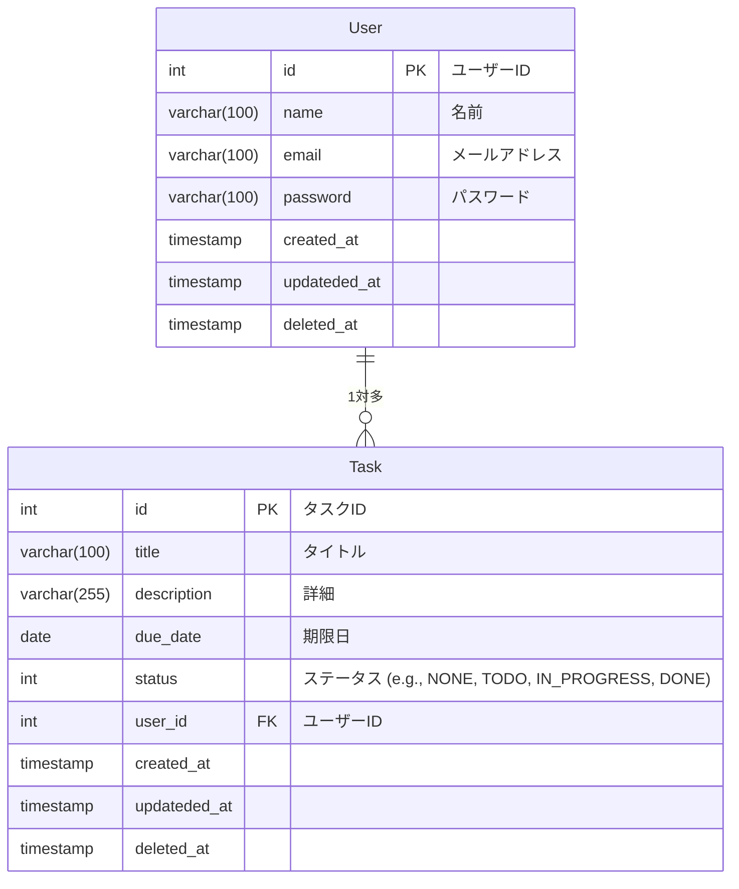

# simple-task-app

## 概要

シンプルなタスク管理アプリケーション

## 実装のポイント

### 開発アプローチ

- Backend,Frontend の共通認識となる RESTAPI の仕様を OpenAPI で定義しておき、スキーマドリブンで開発する。

### Backend API

- シンプルな CRUD 機能を提供する RESTfulAPI。
- クリーンアーキテクチャを意識する。
  - エンティティ、ユースケース、インターフェース（WebAPI, DB など）に関心を分離する
  - 依存性の方向はビジネスルール（エンティティ）に向かって依存する。
  - インターフェースを実装し、依存性を逆転させ DI するようにする。（テストを実装しやすくする）
- 認証機能を実装。AWS Cognito で認証する。
- バリデーション機能を実装
- handler 層は oapi-codegen で OpenAPI からコード生成する
- テストを実装

### infra

- Terraform で IaC

### Other

- GithubActions でビルド・デプロイを自動化

## 環境

### Backend API

- Language: Go 1.23.4
- Web FW: Echo
- handler: oapi-codegen
- ORM: ent

### Database

- RDBMS: PostgreSQL

### infra

- LB: AWS ALB
- Computing: AWS ECS
- DB: AWS RDS Aurora
- IaC: Terraform

### Other

- CI/CD: Github Actions
- Container: Docker

## DB 設計

### サーバー

- database 名 `sampledb`
- 文字コード、タイムゾーン、ログ設定、パフォーマンス設定はデフォルト

### 制約

- 基本、すべてのカラムに NOT NULL 制約をつけてデフォルト値を設定する。deleted_at のみ NULL を許容する
- 文字列は varchar(100), varchar(255), varchar(512)
- CHECK 制約で id の負の値を禁止する
- created_at, updateded_at, deleted_at は固定
- created_at, updateded_at のデフォルトは `CURRENT_TIMESTAMP`とする
- deleted_at のデフォルトは`NULL`とする

### ER 図



### インデックス設計

- フィルターに指定するキーを複合インデックスにしておく
- ソートに使用するキーはインデックスを貼らない
- 命名規則 idx_key1_key2

## Backend

ディレクトリ構成は以下の通り

```
backend/
├── cmd/
│   └── main.go            # メインファイル
├── ent/                   # ドメインモデルやエンティティ
│   └── task.go            # Taskエンティティ
├── repository/            # リポジトリ層 (データアクセス)
│   └── task_repository.go # リポジトリインターフェース
├── service/               # サービス層 (ビジネスロジック)
│   └── task_service.go    # タスクのビジネスロジック
├── handler/               # ハンドラー層 (プレゼンテーション層)
│   └── task_handler.go    # HTTPハンドラー
├── router/                # ルーティング設定
│   └── router.go          # ルーティング処理
├── config/                # 設定管理
│   └── config.go          # 設定情報
├── test/                  # テスト用
│
├── pkg/                   # 再利用可能なパッケージ
│   ├── db/                # DB接続用パッケージ
│   │   └── db.go
│   └── log/               # ロギングユーティリティ
│       └── log.go
```

## 利用方法

[利用方法](docs/note.md)

## 開発メモ

[開発メモ](docs/note.md)
