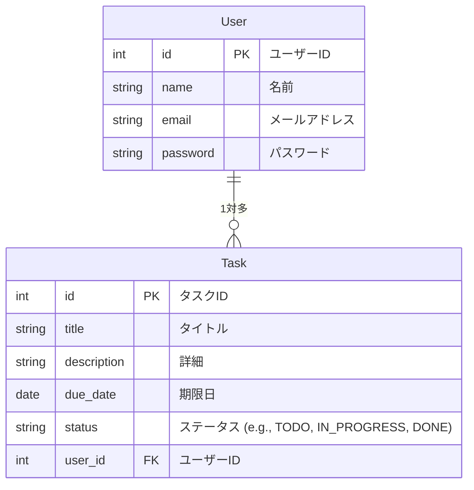

## Overview
* シンプルなタスク管理アプリケーション
* CRUD処理を実装する。
* 認証はBasic認証でメールアドレスとパスワードで認証する。

## ディレクトリ構成

```
project/
├── cmd/
│   └── main.go     # メインファイル                
│
├── internal/
│   ├── ent/                 # ドメインモデルやエンティティ
│   │   └── task.go            # Taskエンティティ
│   ├── repository/            # リポジトリ層 (データアクセス)
│   │   └── task_repository.go # リポジトリインターフェース
│   ├── service/               # サービス層 (ビジネスロジック)
│   │   └── task_service.go    # タスクのビジネスロジック
│   ├── handler/               # ハンドラー層 (プレゼンテーション層)
│   │   └── task_handler.go    # HTTPハンドラー
│   ├── router/                # ルーティング設定
│   │   └── router.go          # ルーティング処理
│   ├── config/                # 設定管理
│   │   └── config.go          # 設定情報
│   └── test/                  # テスト用
│
├── pkg/                       # 再利用可能なパッケージ
│   ├── db/                    # DB接続用パッケージ
│   │   └── db.go              
│   └── logger/                # ロギングユーティリティ
│       └── logger.go
```


## データ設計
* データの構造と関連は以下のER図の通り

